# 🎮 Growgame: 자바 프로그래밍 과제 보고서

## 📌 목차
0. [Overview](#0-시작하기-전에:-Growgame-Overview)
1. [게임 개요 및 핵심 흐름](#1-게임-개요-및-핵심-흐름)
2. [진화 가중치 시스템 (Evolution Weight Mechanism)](#2-진화-가중치-시스템-evolution-weight-mechanism)
3. [7대 종족 분류 및 진화 조건 명세](#3-7대-종족-분류-및-진화-조건-명세)
4. [클래스 아키텍처 및 객체지향 설계](#4-클래스-아키텍처-및-객체지향-설계)
5. [시스템 특화 기능 분석](#5-시스템-특화-기능-분석)
   - 5.1. 둥지 시스템 및 환경 변수 피드백 (Nest System)
   - 5.2. 승천 시스템 및 암호화 무결성 검사 (Ascension & Security Security Logic)
   - 5.3. 도감 시스템 및 파일 I/O 제어 (Encyclopedia System)
6. [결론 및 객체지향적 총평](#6-결론-및-객체지향적-총평)

---
## 0. 시작하기 전에: Growgame  Overview

본 섹션은 `Growgame`의 핵심 플레이 흐름과 주요 기능들을 직관적으로 파악할 수 있도록 요약한 가이드다.

### 0.1. 환경 변수 (Environment Variables)
게임 내 생태계는 고정되어 있지 않으며, 매일 갱신되는 두 가지 핵심 환경 변수에 의해 끊임없이 변화한다.
* **날씨 (Weather):** 맑음, 흐림, 비, 바람, 폭염, 천둥, 황사, 한파, 종말, 광명, 암전 (총 11종)
* **필드 효과 (Field Effect):** 평화로움, 자기장, 과잉마나, 신비로움, 공허, 무중력 (총 6종)

### 0.2. 게임의 전체 흐름 및 타임라인 (Timeline)
몬스터는 총 3번의 생애 주기를 거치며, 각 단계마다 플레이어가 개입할 수 있는 상호작용과 목표가 달라진다. 하루는 **아침, 점심, 저녁**의 3턴으로 구성된다.

* **[ 1단계 ] 알 단계 (Day 1 ~ 14)**
  * **상호작용:** 돌보기, 먹이주기, 둥지 관리, 방치하기
  * **목표:** 개체의 기본 스탯 및 고유 변수인 '온도(temp)'를 관리한다. 플레이어의 행동과 날씨가 온도에 직접적인 타격을 준다.
  * **분기점:** 15일 차 아침, 누적된 스탯과 환경 변수를 바탕으로 1차 진화(checkEv1)가 진행된다.

* **[ 2단계 ] 유년기 단계 (Day 15 ~ 29)**
  * **상호작용:** 놀아주기, 밥주기, 훈련하기, 방치하기, 씻기기
  * **목표:** 7종 중 하나로 태어난 유년기 개체의 종족별 고유 은닉 변수(예: 포악함, 마나 적응력 등)와 5대 전투 스탯을 본격적으로 훈련한다.
  * **분기점:** 30일 차 아침, 2차 진화(checkEv2) 연산을 통해 최종 36종의 성체 중 하나로 진화한다.

* **[ 3단계 ] 성체 단계 (성체 진화 후 10일간)**
  * **상호작용:** 체력 훈련, 스피드 훈련, 공격 훈련, 방어 훈련, 마력 집중, 휴식
  * **목표:** 스태미나(Stem)를 소모하는 단독 집중 훈련 모드에 돌입하여 최종 스탯을 극대화한다.
  * **분기점 (엔딩):** 10일의 훈련이 끝나면 아래 두 가지 선택지 중 하나를 결정한다.
    1. **승천 (Ascension):** 개체를 신화적 존재로 떠나보냅니다. 개체의 스탯과 도감 해금 정보가 암호화되어 로컬 파일(`.txt`)에 영구 보존된다. 또한, 언제든지 게임 내 단축키`f`를 통해 다시  `nest`로 load 할 수 있다.
    2. **둥지 (Nest):** 최대 10마리까지 수용 가능한 공유 공간에 개체를 안착시킨다. 안착된 성체는 자신의 고유한 날씨 및 필드 패시브 효과를 다음 세대의 육성 환경에 영구적으로 영향을 끼친다.

### 0.3. 1차 진화 분기 조건 (Egg -> Baby)
15일 차 아침에 발생하는 1차 진화는 단순히 무작위가 아니며, 알 단계에서 누적된 육성 방식과 조우한 환경에 따라 각 종족별 가중치가 실시간으로 연산된다.

| 계통 (유년기) | 주요 가중치 상승 및 확정 조건 로직 |
| :--- | :--- |
| **드래곤** | 포만감에 비례하여 상승. 온도가 36도 초과 시 비례 상승. <br> 맑음/흐림 이외의 악천후 조우 시 가산점. 날씨 [종말] 시 대폭 상승. <br> 필드 [평화로움] 외 조우 시 상승. 날씨 [광명, 암전] 조우 시 진화 루트 원천 차단. |
| **정령** | 필드 [과잉마나, 신비로움] 조우 시 대폭 상승. 날씨 [맑음, 흐림] 시 소폭 상승. <br> 친밀도에 비례하여 가산되며, 스트레스에 비례하여 감산됨. |
| **슬라임** | 가장 안정적인 기본 가중치(150)를 보유. <br> 필드 [평화로움] 조우 시 추가 가중치 획득. |
| **골렘** | 날씨 [황사] 시 대폭 상승. 필드 [신비로움, 무중력] 조우 시 상승. <br> 포만감이 낮게 유지될수록 가중치 상승, 온도가 20도 이하(저온)일 때 추가 상승. |
| **전투로봇** | 필드 [자기장] 시 대폭 상승. 날씨 [천둥] 시 상승. <br> 포만감이 낮게 유지될수록 상승, 온도가 20도 이하(저온)일 때 추가 상승. |
| **언데드** | 날씨 [암전] 시 대폭 상승. 날씨 [종말] 시 상승. <br> 스트레스가 높고 포만감이 낮을수록 상승. 온도 20도 이하(저온) 시 추가 상승. |
| **공허유충** | 기본 가중치 0점의 히든 루트. <br> 필드 [공허] 조우 시, 타 6개 종족의 가중치를 일괄 감산하며 단독으로 대폭 상승. <br> 날씨 [종말, 암전] 및 필드 [무중력] 조우 시 상승. 스트레스 비례 상승. |

---
## 1. 게임 개요 및 핵심 흐름
본 프로젝트는 구조화된 자바 객체지향 아키텍처를 기반으로 설계된 '환경 상호작용형 몬스터 육성 시뮬레이션 게임'이다. 플레이어는 가상의 환경 변수 속에서 몬스터의 스탯을 관리하고, 조건별 확률 메커니즘을 거쳐 최종 성체로 진화시키는 것을 목표로 한다. 시스템은 '세대교체 메커니즘'을 채택하여, 이전 세대 성체의 업적이 다음 세대의 초기 환경에 누적 피드백되는 유기적인 구조를 가진다.

### 1.1. 시간 시퀀스 및 턴 루프 매커니즘
게임의 내부 시계는 일차(`day`)와 턴(`turn`)이라는 두 가지 축으로 구동되며, `Growgame.java` 엔진의 메인 루프를 통해 제어된다.

* **시간의 기본 단위 (Turn)**: 하루는 `아침(0)`, `점심(1)`, `저녁(2)`의 3개 턴으로 분할된다. 플레이어가 유효한 행동 명령을 수행할 때마다 `advanceTurn()`이 호출되어 턴이 순차적으로 소모된다.
* **일차 경과 및 환경 갱신 (Day)**: 저녁(2) 턴의 행동이 종료되면 `turn`은 다시 `아침(0)`으로 초기화되고 `day`가 1 증가한다. 이 시점에 내부 환경 변수 제어기인 `updateEnvironment()`가 매번 실행되어 새로운 하루의 날씨와 필드 상태를 결정한다.

### 1.2. 몬스터의 3단계 성장 주기

몬스터 객체는 최상위 추상 클래스인 `Monster`를 상속받으며, 시간에 흐름에 따라 내부 상태 패턴과 다형성을 통해 총 3단계의 생명 주기를 거친다.
1. **알 단계 (Egg Class)**: 게임 시작 시점인 1일 차부터 14일 차까지의 형태이다. 고유 변수인 온도(`temp`)가 존재하며, 플레이어의 관리 방식과 날씨에 따라 온도가 실시간으로 변동된다.
2. **유년기 단계 (Baby Class)**: 15일 차 아침, 엔진의 `checkEv1()` 메서드가 실행되면서 육성 데이터에 기반해 총 7가지 계통(`BabyDragon`, `BabySpirit`, `BabySlime`, `BabyGolem`, `BabyRobot`, `BabyUndead`, `BabyVoid`) 중 하나의 유년기 객체로 다형성 전환된다.
3. **성체 단계 (Adult Interface 구현체)**: 30일 차 아침이 되면 `checkEv2()`를 통해 성체 고유 ID를 연산하고, `factory()` 메서드를 거쳐 최종 성체 객체(총 36종)로 변태한다. 성체 단계로 진화하는 즉시 내부 `day`는 0으로 리셋되며, 10일 동안 스태미너(`stem`) 시스템 기반의 '단독 집중 훈련 모드'를 수행한 후 기나긴 육성의 마침표를 찍게 된다.

### 1.3. 상호작용 및 환경 변수의 연관 관계
본 게임의 핵심은 플레이어의 선택 명령어(행동 매개변수)와 시스템 환경 변수(날씨 및 필드)의 밀접한 결합성에 있다.

* **플레이어 상호작용**: 성장 단계별로 UI 명령어가 유기적으로 확장된다. 알 단계에서는 `돌보기`, `먹이주기`, `둥지 관리`, `방치하기`가 제공되며, 유년기 단계에서는 `놀아주기`, `먹이주기`, `훈련하기`, `방치하기`, `씻기기`로 세분화되어 개체의 스탯 수치(`fullness`, `affinity`, `stress` 등) 및 종족 특화 히든 스탯들을 조동한다.
* **날씨(Weather) 시스템**: 총 11가지 상태(`맑음`, `흐림`, `비`, `바람`, `폭염`, `천둥`, `황사`, `한파`, `종말`, `광명`, `암전`)가 존재하며, 개체의 내부 온도 타격 및 진화 스탯 연산에 직접적인 가중치 피드백을 부여한다.
* **필드 효과(Field Effect)**: 총 6가지 상태(`평화로움`, `자기장`, `과잉마나`, `신비로움`, `공허`, `무중력`)로 분류된다. 필드는 특정 행동 시 가중치를 추가 누적시키거나(예: 공허 필드에서의 저주 스탯 상승), 1·2차 진화 판정 시 특정 종족의 발현 확률을 극대화하는 촉매제 역할을 수행한다.


---

## 2. 진화 가중치 시스템 (Evolution Weight Mechanism)

본 게임의 진화는 단순한 고정 확률(RNG)에 의존하지 않는다. 개체의 내부 스탯(포만감, 친밀도, 스트레스, 온도 등)과 외부 환경 변수(날씨, 필드 효과)를 종합하여 실시간으로 진화 확률을 보정하는 **동적 가중치 시스템(Dynamic Weight Mechanism)**을 채택했다.

### 2.1. 가중치 보정 매커니즘
진화 판정을 수행하는 `calEv(int w, int f)` 메서드는 배열을 활용해 각 진화 루트별 베이스 가중치(Base Weight)를 할당한 뒤, 개체가 겪은 조건에 따라 배열 인덱스의 값을 증감시킨다. 

* **환경 변수 보정**: 예를 들어 `Egg.java`에서 날씨가 '종말(8)'일 경우 드래곤과 언데드, 공허생명체의 가중치가 상승하지만, '광명(9)'이나 '암전(10)'일 경우 드래곤의 진화 가중치는 `-9999`로 처리되어 해당 루트가 원천 차단된다. 
* **스탯 변수 비례 연산**: 단순 조건문 뿐만 아니라 `(this.fullness / 20)`처럼 개체의 현재 수치에 비례하여 가중치를 점진적으로 가산하는 방식을 사용하여, 플레이어의 육성 성향이 진화 확률에 유기적으로 반영되도록 설계되었다.
* **히든 스탯 누적**: 2차 진화 시에는 `lowFullnessTurns`(포만감이 낮은 상태로 버틴 턴 수), `coldWaveTurns`(한파 조우 횟수) 등 특정 악조건을 견딘 횟수를 은닉 변수로 트래킹하여 특수 개체(예: 한철골렘)의 진화 가중치를 파격적으로 올리는 기믹이 포함되어 있다.

### 2.2. 누적 확률 기반 진화 연산 로직
보정된 가중치 배열은 최종적으로 **누적 확률 연산(Cumulative Probability Calculation)**을 거쳐 단 하나의 진화 인덱스를 반환한다. 음수 가중치를 0으로 방어하는 예외 처리와, 총합이 0이 되는 극단적 버그 상황에 대비해 가장 안정적인 생명체(슬라임)를 반환하는 안전장치(Fail-Safe)까지 완벽하게 구현되어 있다.

```java
// [코드 인용]: Egg.java의 진화 확률 추출 로직 발췌
int totalScore = 0;
for (int i = 0; i < evScores.length; i++) {
    if (evScores[i] < 0) {
        evScores[i] = 0; // 음수 방지 처리
    }
    totalScore += evScores[i]; 
}

// 극단적 예외 상황: 모든 점수가 0이 될 경우 가장 안정적인 개체(슬라임: 인덱스 2) 반환
if (totalScore == 0) return 2; 

int randObj = random.nextInt(totalScore); 
int cumulative = 0;

for (int i = 0; i < evScores.length; i++) {
    cumulative += evScores[i];
    if (randObj < cumulative) {
        return i; // 최종 진화할 종족의 인덱스 반환
    }
}
```
#### 예시코드) 아래는 드래곤(Dragon)종족의 실제 진화 연산 가중치 코드다.
```java
@Override
    public int calEv(int w, int f) {
        // 2차 진화 가중치 연산
        // 인덱스: 0:엘더, 1:원소, 2:환상, 3:토룡, 4:흑염
        int[] weights = {10, 40, 15, 50, 5}; // 베이스라인

        // 0. 엘더드래곤 (기본 10)
        if (w == 9) weights[0] += 15; // 광명 매우 가점 
        if (f == 2) weights[0] += 2; // 과잉마나 가점
        if (this.ferocity > 60) weights[0] -= 3; // 일정 포악함 초과 시 감점 
        if (this.manaAdaptability > 85) weights[0] += 4; // 마나 적응력 조건

        // 1. 원소드래곤 (기본 40)
        // 맑음(0), 흐림(1), 종말(8), 광명(9), 암전(10) 제외 시 가점
        if (w >= 2 && w <= 7) weights[1] += 3; //

        // 2. 환상룡 (기본 15)
        if (f == 3 || f == 2) weights[2] += 4; // 신비로움, 과잉마나 가점
        weights[2] += (this.manaAdaptability / 20); // 마나 적응력 비례
        weights[2] -= (this.ferocity / 30); // 포악함 감점

        // 3. 토룡 (기본 50)
        weights[3] += (this.fullness / 40); // 포만감 비례 가점

        // 4. 흑염룡 (기본 5)
        weights[4] += (this.ferocity / 5); // 포악함 높은 가점
        if (w == 10) weights[4] += 20; // 암전 가점
        if (this.manaAdaptability > 80) weights[4] += 2; // 마나 적응력 조건

        // 확률 계산 루프
        int total = 0;
        for (int i = 0; i < weights.length; i++) {
            if (weights[i] < 0) weights[i] = 0;
            total += weights[i];
        }

        if (total == 0) return 3; // 최악의 경우 가장 흔한 토룡 반환

        int r = random.nextInt(total);
        int cum = 0;
        for (int i = 0; i < weights.length; i++) {
            cum += weights[i];
            if (r < cum) return i;
        }
        return 3;
    }
    

```

---

## 3. 7대 종족 분류 및 진화 조건 명세
15일 차에 도달한 개체는 내부 스탯과 환경 변수의 결합도에 따라 총 7가지의 유년기(Baby) 종족 중 하나로 1차 진화한다. 이후 30일 차까지 누적된 육성 데이터와 은닉 변수(Hidden Status)를 바탕으로 각 계통별 성체(Adult)로 2차 최종 진화하게 된다. 총 36종의 성체 진화 조건은 다음과 같이 설계되어 있다.

### 3.1. 종족별 진화 조건표

| 계통 (유년기) | 성체명 (Adult) | 진화 가중치 및 확정 조건 로직 |
| :--- | :--- | :--- |
| **드래곤**<br>(BabyDragon) | 엘더드래곤 | 날씨 [광명], 필드 [과잉마나] 시 가중치 상승. 포악함 60 초과 시 감점. |
| | 원소드래곤 | 날씨가 특정 원소 상태(2~7)일 때 가중치 상승. |
| | 환상룡 | 필드 [신비로움, 과잉마나] 및 마나 적응력 비례 상승. 포악함 비례 감점. |
| | 토룡 | 포만감에 비례하여 가중치 상승 (가장 흔한 베이스 개체). |
| | 흑염룡 | 포악함 및 마나 적응력이 높고, 날씨 [암전] 조우 시 대폭 상승. |
| **정령**<br>(BabySpirit) | 미정령 | **[확정]** 마나 적응력 100 미만일 경우 무조건 진화. |
| | 정령왕 | 마나 적응력 150 이상 & [공허] 필드 미경험 시 진화풀 편입. |
| | 암흑정령 | 스트레스 비례 상승 및 포만감 반비례 상승. 날씨 [암전] 시 대폭 상승. |
| | 원소정령 | 특정 원소 날씨(2~7) 조우 시 가중치 상승. |
| **슬라임**<br>(BabySlime) | 데미갓 | **[확정]** 11종의 모든 날씨와 6종의 모든 필드를 경험했을 경우 진화. |
| | 슬라임킹 | **[확정]** 데미갓 실패 후, 모든 날씨를 경험했을 경우 진화. |
| | 슬라임퀸 | **[확정]** 데미갓 실패 후, 모든 필드를 경험했을 경우 진화. |
| | 원소슬라임 | 원소 날씨(2~7) 조우 시 상승 (베이스 개체). |
| | 다크슬라임 | 누적 스트레스 수치에 비례하여 가중치 증가. |
| **골렘**<br>(BabyGolem) | 거대골램 | 견고함(solid) 스탯에 비례하여 상승. |
| | 키네틱 골렘 | 필드 [무중력, 신비로움, 과잉마나] 상태 조우 시 가중치 대폭 상승. |
| | 가드골렘 | 친밀도 비례 가산, 포만감 비례 감산 적용. |
| | 원소골렘 | 원소 날씨(2~7) 및 포만감 15 이하로 버틴 턴 수(lowFullnessTurns)에 비례. |
| | 한철골렘 | 날씨 [한파]를 조우한 턴 수(coldWaveTurns) 비례 파격적 가중치 부여. |
| **전투로봇**<br>(BabyRobot) | 기계신 | **[확정]** 소프트웨어(SW)와 하드웨어(HW) 수치가 정확히 일치할 경우 진화. |
| | 위성폭격기 | 필드 [무중력] 및 HW 스탯 90 이상일 때 가중치 상승. |
| | 안티매직 | 필드 [과잉마나] 및 SW 스탯 90 이상일 때 가중치 상승. |
| | 안드로이드 | 친밀도 50을 기준으로 초과 시 가산, 미만 시 감산. |
| | 레인저 | 매 턴 SW > HW 조건을 달성하여 누적된 보너스 수치(rangerBonus) 반영. |
| | 워머신 | 매 턴 HW > SW 조건을 달성하여 누적된 보너스 수치(warMachineBonus) 반영. |
| **언데드**<br>(BabyUndead) | 사신 | **[확정]** 저주(curse) 스탯이 10에 도달할 경우 진화. |
| | 영생자 | **[확정]** 저주 0 & 유독성 30 미만 & 부패 30 미만 달성 시 진화. |
| | 좀비 | 부패 스탯이 80을 넘긴 턴 수(highC)에 비례하여 상승 (베이스 개체). |
| | 스켈레톤 | 매 턴 (부패<=50 & 유독성<=50) 유지 시 누적되는 보너스 수치 반영. |
| | 포식자 | 친밀도가 0에 닿은 턴 수(zeroA)마다 매우 높은 가중치 가산. |
| **공허유충**<br>(BabyVoid) | 공허여왕 | **[확정]** 진화치(evo) 999 도달 시 최우선 진화. |
| | 공허포식자 | **[확정]** 스트레스 100 유지 및 진화치 850 이상일 경우 진화. |
| | 공허군주 | 스트레스가 0일 때 가중치 상승. |
| | 공허유랑자 | 기본 가중치 적용 (31). |
| | 공허생산자 | 기본 가중치 적용 (41, 베이스 개체). |
| | 공허수확자 | 기본 가중치 적용 (21). |

### 3.2. 은닉 변수 트래킹 로직 (Hidden Status Tracking)

게임 시스템은 명시적인 5대 스탯 외에도 개체가 겪은 환경과 상태를 턴마다 배열이나 누적 변수로 추적한다. 예를 들어 `BabySlime` 클래스는 매 턴마다 엔진으로부터 전달받는 날씨와 필드 인덱스를 boolean 배열에 기록하여 '데미갓' 진화 조건을 검증한다.

```java
// [코드 인용]: BabySlime.java의 환경 경험 누적 및 확정 진화 분기 로직
@Override
public int calEv(int w, int f) {
    // 매 턴 엔진으로부터 전달받는 날씨와 필드 인덱스를 배열에 기록
    if (w >= 0 && w < expWeather.length) expWeather[w] = true;
    if (f >= 0 && f < expFields.length) expFields[f] = true;

    // (배열 순회로 allWeather, allFields 검사 로직 생략...)

    // 0. 데미갓: 모든 날씨와 필드를 전부 경험한 경우
    if (allWeather && allFields) return 0;
    
    // 1. 슬라임킹: 데미갓 조건을 만족 못 하고, 모든 날씨만 경험한 경우
    if (allWeather) return 1;
    
    // 2. 슬라임퀸: 데미갓 조건을 만족 못 하고, 모든 필드만 경험한 경우
    if (allFields) return 2;
    
    // 이후 가중치 확률 진화 분기 처리...
}
```

---

## 4. 클래스 아키텍처 및 객체지향 설계

```mermaid
classDiagram
    direction BT

    %% 핵심 인터페이스 및 추상 클래스
    class Adult {
        <<Interface>>
    }
    class Monster {
        <<Abstract>>
    }
    class Baby {
        <<Abstract>>
    }

    %% 게임 메인 엔진 (연관 관계)
    class Growgame {
    }
    class Testmain {
    }
    Testmain ..> Growgame : uses
    Growgame o-- Monster : manages

    %% 1차 분기 (알 -> 유년기)
    Egg --|> Monster
    Baby --|> Monster

    BabyDragon --|> Baby
    BabySpirit --|> Baby
    BabySlime --|> Baby
    BabyGolem --|> Baby
    BabyRobot --|> Baby
    BabyUndead --|> Baby
    BabyVoid --|> Baby

    %% 2차 분기 (드래곤 계통 성체)
    ElderDragon --|> BabyDragon
    ElderDragon ..|> Adult
    ElementDragon --|> BabyDragon
    ElementDragon ..|> Adult
    FantasyDragon --|> BabyDragon
    FantasyDragon ..|> Adult
    EarthDragon --|> BabyDragon
    EarthDragon ..|> Adult
    BlackFlameDragon --|> BabyDragon
    BlackFlameDragon ..|> Adult

    %% 2차 분기 (정령 계통 성체)
    MinorSpirit --|> BabySpirit
    MinorSpirit ..|> Adult
    SpiritKing --|> BabySpirit
    SpiritKing ..|> Adult
    DarkSpirit --|> BabySpirit
    DarkSpirit ..|> Adult
    ElementalSpirit --|> BabySpirit
    ElementalSpirit ..|> Adult

    %% 2차 분기 (슬라임 계통 성체)
    Demigod --|> BabySlime
    Demigod ..|> Adult
    SlimeKing --|> BabySlime
    SlimeKing ..|> Adult
    SlimeQueen --|> BabySlime
    SlimeQueen ..|> Adult
    ElementalSlime --|> BabySlime
    ElementalSlime ..|> Adult
    DarkSlime --|> BabySlime
    DarkSlime ..|> Adult

    %% 2차 분기 (골렘 계통 성체)
    GiantGolem --|> BabyGolem
    GiantGolem ..|> Adult
    KineticGolem --|> BabyGolem
    KineticGolem ..|> Adult
    GuardGolem --|> BabyGolem
    GuardGolem ..|> Adult
    ElementalGolem --|> BabyGolem
    ElementalGolem ..|> Adult
    ColdIronGolem --|> BabyGolem
    ColdIronGolem ..|> Adult

    %% 2차 분기 (전투로봇 계통 성체)
    DeusExMachina --|> BabyRobot
    DeusExMachina ..|> Adult
    SatelliteBomber --|> BabyRobot
    SatelliteBomber ..|> Adult
    AntiMagicWeapon --|> BabyRobot
    AntiMagicWeapon ..|> Adult
    AndroidModule --|> BabyRobot
    AndroidModule ..|> Adult
    RangerModule --|> BabyRobot
    RangerModule ..|> Adult
    WarMachine --|> BabyRobot
    WarMachine ..|> Adult

    %% 2차 분기 (언데드 계통 성체)
    GrimReaper --|> BabyUndead
    GrimReaper ..|> Adult
    Immortal --|> BabyUndead
    Immortal ..|> Adult
    Zombie --|> BabyUndead
    Zombie ..|> Adult
    Skeleton --|> BabyUndead
    Skeleton ..|> Adult
    Predator --|> BabyUndead
    Predator ..|> Adult

    %% 2차 분기 (공허유충 계통 성체)
    VoidQueen --|> BabyVoid
    VoidQueen ..|> Adult
    VoidPredator --|> BabyVoid
    VoidPredator ..|> Adult
    VoidLord --|> BabyVoid
    VoidLord ..|> Adult
    VoidWanderer --|> BabyVoid
    VoidWanderer ..|> Adult
    VoidProducer --|> BabyVoid
    VoidProducer ..|> Adult
    VoidHarvester --|> BabyVoid
    VoidHarvester ..|> Adult
```



위의 다이어그램은 본 프로젝트의 전체 28개 클래스 및 인터페이스 간의 유기적인 상속 관계와 다형성 구조를 시각화한 아키텍처이다. 전체 시스템은 단일 상속의 한계를 극복하고 계층별 책임을 명확히 분리하기 위해 최상위 추상 클래스, 중간 도메인 추상 클래스, 그리고 공통 행위 명세를 위한 인터페이스의 삼각 구조로 정교하게 설계되었다.

### 4.1. 다단계 추상화 계층 (Abstraction Hierarchy)
시스템은 개체의 성장 주기에 맞춰 추상화 수준을 단계별로 구체화하는 구조를 취한다.

* **최상위 추상 클래스 `Monster`**: 모든 개체가 공유하는 기본 전투 스탯(`hp`, `speed`, `attack`, `defense`, `magic`)과 상태 변수(`fullness`, `affinity`, `stress`), 그리고 종족명(`tribe`)을 캡슐화한다. 외부 UI 가독성을 위한 오버로딩 메서드 `display()`의 기본 뼈대를 제공하여 코드 중복을 원천 차단한다.
* **하위 추상 클래스 `Baby`**: 알(`Egg`) 단계를 지나 1차 진화를 마친 유년기 개체들의 공통 상호작용 흐름을 제어하는 제어 계층이다. 플레이어의 명령어 처리를 오버라이딩하고, 자식 클래스로부터 비용과 효과 데이터를 역으로 전달받아 스태미너 검증 및 차감을 일괄 처리하는 중추적 역할을 수행한다.

### 4.2. 템플릿 메서드 패턴 구조를 통한 확장성 확보
`Baby` 클래스는 고유의 상호작용 및 훈련 흐름인 `executeTraining(int choice, Adult adultRef)` 메서드를 구현해 두고, 이에 필요한 세부 명세는 자식 클래스가 오버라이딩하도록 유도하는 형태를 띤다.

```java
// [코드 인용]: Baby.java에 구현된 공통 제어 흐름과 하위 이관 abstract method.
protected void executeTraining(int choice, Adult adultRef) {
    if (choice < 1 || choice > 5) return;

    int cost = getStaminaCost(choice); // 자식 클래스로부터 훈련 비용 수집
    if (adultRef.getStem() < cost) {
        System.out.println("❌ 스태미너가 부족하여 훈련을 진행할 수 없습니다!");
        return;
    }
    adultRef.setStem(adultRef.getStem() - cost); // 공통 제어 로직 수행
    applyTrainingStats(choice); // 실제 스탯 증가 처리를 하위 클래스로 위임
}

// 하위 종족 클래스들이 강제로 구현해야 할 확장 포인트
protected abstract int getStaminaCost(int choice);
protected abstract void applyTrainingStats(int choice);
protected abstract String[] getComments();
```

이를 통해 `BabyDragon`, `BabyVoid` 등 7대 유년기 클래스들은 상위의 스태미너 검증 로직을 재구현할 필요 없이, 각 종족에 특화된 스탯 증감치와 코멘트 배열만 독립적으로 확장하면 되므로 높은 응집도와 유지보수성을 동시에 확보하게 된다.

### 4.3. 다중 상속 효과를 위한 `Adult` 인터페이스의 결합
본 아키텍처의 가장 고도화된 부분은 최종 진화 형태인 36종의 성체 클래스 설계에 있다. 자바는 클래스 간의 다중 상속을 금지하므로, 성체 클래스들은 상위 유년기 클래스를 상속(`extends`)하여 기존 육성 데이터를 온전히 보존하는 동시에, 성체 전용 규격인 `Adult` 인터페이스를 구현(`implements`)하는 구조를 채택했다.

* **인터페이스 디폴트 메서드(`default`) 활용**: `Adult` 인터페이스 내부에 성체 전용 훈련 UI(`qt`), 훈련 흐름 제어(`dt`), 엔딩 분기 선택 UI 및 실행 로직(`qe`, `de`)을 디폴트 메서드로 탑재함으로써 인터페이스의 규격 명세 역할과 공통 로직 공유라는 이점을 동시에 달성했다.
* **느슨한 결합(Loose Coupling)과 업캐스팅**: 메인 엔진인 `Growgame.java`는 36종에 달하는 성체 객체들의 구체적인 클래스 타입을 일일이 분기하여 처리할 필요가 없다. 성체 진화 이후에는 모든 몬스터 개체를 `Adult` 인터페이스 타입으로 안전하게 업캐스팅(Upcasting)하여 제어하므로, 새로운 성체 종족이 추가되더라도 메인 엔진의 코드는 단 한 줄도 수정되지 않는 효율적인 구조를 보인다.


---

## 5. 시스템 특화 기능 분석

### 5.1. 둥지 시스템 및 환경 변수 피드백 (Nest System)

본 게임의 핵심 차별점은 한 번 육성된 개체가 단발성으로 소모되지 않고, '둥지(Nest)'라는 공유 자원 공간에 안착하여 다음 세대의 환경 변수에 실시간으로 개입하는 유기적인 피드백 루프에 있다.

#### 10마리 고정 배열 기반의 둥지 관리
메인 엔진인 `Growgame.java`는 둥지를 최대 10마리의 몬스터를 수용할 수 있는 고정 배열(`private Monster[] nest;`)로 관리한다. 성체 육성이 종료되는 시점에 둥지 배열의 여유 공간을 검사하며, 플레이어는 승천과 둥지 안착 중 하나를 선택할 수 있다. 만약 둥지가 10마리로 가득 차 배열의 한계에 도달했다면, 시스템 권한으로 강제 승천 처리되어 배열의 오버플로우를 사전에 방지한다.

#### 다형성을 활용한 환경 피드백 (updateEnvironment 로직)
새로운 게임 루프가 시작되거나 환경 변수가 갱신될 때, 시스템은 둥지 배열을 순회하며 안착된 성체들의 `WeatherEffect()` 및 `FieldEffect()` 메서드를 다형성으로 호출하여 환경에 간섭한다.

```java 
// 환경 변수 업데이트 (둥지 시스템 연계)
    private void updateEnvironment() {
        SecureRandom random = new SecureRandom();
        
        //날씨(Weather) 구현 ---
        ArrayList<Integer> weatherPool = new ArrayList<>();
        
        // 둥지를 순회하며 Adult 규격을 갖춘 개체의 날씨 효과만 추출
        for (int i = 0; i < nest.length; i++) {
            if (nest[i] != null && nest[i] instanceof Adult) {
                int wEffect = ((Adult) nest[i]).WeatherEffect();
                if (wEffect != -1) {
                    weatherPool.add(wEffect); // 유효한 날씨 효과 수집
                }
            }
        }
        
        if (!weatherPool.isEmpty()) {
            // 간섭 있음: 둥지 몬스터들의 효과 중 하나를 무작위로 채택하여 고정
            int selectedIndex = random.nextInt(weatherPool.size());
            this.weather = weatherPool.get(selectedIndex);
        } else {
            // 간섭 없음: 기본 확률에 따라 무작위 결정
            int rand = random.nextInt(100); // 0 ~ 99 사이의 난수 추출
            if (rand < 30) { this.weather = 0; } // 맑음
            else if (rand < 45) { this.weather = 1; } // 흐림
            else if (rand < 60) { this.weather = 2; } // 비
            else if (rand < 69) { this.weather = 3; } // 바람
            else if (rand < 78) { this.weather = 4; } // 폭염
            else if (rand < 85) { this.weather = 5; } // 천둥
            else if (rand < 92) { this.weather = 6; } // 황사
            else if (rand < 99) { this.weather = 7; } // 한파
            else { this.weather = 8; } // 종말
        }
        
        //필드(Field) 구현 ---
        int[] fieldProbs = {90, 2, 2, 2, 2, 2};

        // 둥지를 순회하며 필드 확률 지분 뺏어오기 로직 적용
        for (int i = 0; i < nest.length; i++) {
            if (nest[i] != null && nest[i] instanceof Adult) {
                int boostField = ((Adult) nest[i]).FieldEffect();
                
                // 1~5번 사이의 유효한 필드 번호일 경우 지분 강탈
                if (boostField >= 1 && boostField <= 5) {
                    fieldProbs[0] -= 9;
                    fieldProbs[boostField] += 9;
                }
            }
        }
```

### 5.2. 승천 시스템 및 암호화 무결성 검사 (Ascension & Security Logic)

성체 육성이 완료되어 '승천(Ascension)'을 선택하거나 둥지가 가득 차 강제 승천이 집행될 경우, 해당 개체의 육성 결과(스탯 및 종족 ID)는 외부 텍스트 파일 형식으로 영구 보존된다. 이때, 사용자가 텍스트 파일을 임의로 수정하여 비정상적인 스탯을 조작(Cheat)하는 행위를 원천 차단하기 위해 해시(Hash) 연산 기반의 무결성 검사(Integrity Check) 로직을 도입했다.

#### 소수(Prime Number)를 활용한 난수 해싱 (SCode 알고리즘)
`Adult` 인터페이스의 `makeinfo()` 디폴트 메서드는 개체의 핵심 스탯에 각기 다른 소수(3, 5, 7, 11, 13, 17)를 곱하여 누적된 `hash` 값을 산출한다. 이후 세 자리 수 중 가장 큰 소수인 997로 나눈 나머지 값을 `SCode(Security Code)`로 발급하여 최종 저장 문자열에 덧붙인다.

```java
// [코드 인용]: Adult.java의 makeinfo() 해시 연산 보안식
long hash = (getAdultId() * 3L) + 
            (getHp() * 5L) + 
            (getSpeed() * 7L) + 
            (getAttack() * 11L) + 
            (getDefense() * 13L) + 
            (getMagic() * 17L);
            
// 997로 나눈 나머지를 사용하여 SCode를 0 ~ 996 사이의 예측 불가능한 값으로 고정
int SCode = (int) (hash % 997);
```
#### 파일 로드 시 무결성 교차 검증 (Mathematical Integrity Verification)
시스템은 저장된 텍스트 파일을 역으로 읽어 들이는 복원 프로세스에서도 동일한 수학적 해시 메커니즘을 통한 교차 검증(Cross-Verification)을 수행한다. 사용자가 외부 편집기로 `.txt` 파일 내부의 스탯 수치를 단 1이라도 임의 조작(Forgery)하는 행위를 원천적으로 차단하기 위한 수학적 방어 메커니즘의 상세 구조는 다음과 같다.

1. **가중 선형 결합 해시 함수 (Weighted Linear Combination Hash Function)**: `Adult` 인터페이스의 `makeinfo()`에 구현된 해시 공식은 개체의 고유 ID 및 5대 스탯 데이터 벡터 $\vec{X} = (x_1, x_2, x_3, x_4, x_5, x_6)$에 대하여 각각 서로 다른 고유한 소수(Prime Number) 가중치 세트 $P = \{3, 5, 7, 11, 13, 17\}$를 매핑하여 가중 선형 결합을 수행한다.

$$\text{Hash}( \vec{X} ) = 3x_1 + 5x_2 + 7x_3 + 11x_4 + 13x_5 + 17x_6$$

임의의 합성수가 아닌 소수를 승수로 사용하는 수학적 이유는 스탯 변수 간의 결합 시 발생할 수 있는 대칭성을 붕괴시키고 수치 간의 간섭을 최소화하여, 데이터의 미세한 변동이 해시 결과값의 거대한 비선형적 차이로 이어지도록 유도하기 위함이다.

2. **모듈러 축소 및 균등 분포 (Modular Reduction & Uniform Distribution)**: 산출된 거대한 `hash` 스칼라 값은 세 자리 수 중 가장 큰 소수인 $997$을 제수로 하는 모듈러 연산($\pmod{997}$)을 거쳐 $0$부터 $996$ 사이의 해시 공간(Hash Space)으로 축소된다.

$$\text{SCode} = \text{Hash}( \vec{X} ) \pmod{997}$$

수학적으로 소수 체계에서의 모듈러 연산은 나머지 값들이 특정 구간에 치우치지 않고 공간 내에 균등 분포(Uniform Distribution)를 이루도록 보장하므로, 해시 충돌(Hash Collision) 확률을 수학적으로 극단적으로 억제하는 탁월한 방어선 역할을 수행한다.

3. **런타임 교차 검증 루틴**: `Growgame.java` 엔진이 외부 세이브 데이터를 로드할 때, 복원된 벡터를 기반으로 내부에서 `SCODE`를 재연산한다. 이후 파일 말단에 기록되어 있던 오리지널 `SCODE`와의 대수적 일치 여부를 boolean 검증문으로 교차 판정한다.

$$\text{Verification} = \begin{cases} \text{True}, & \text{if } \text{SCode}_{\text{calc}} == \text{SCode}_{\text{file}} \\ \text{False}, & \text{if } \text{SCode}_{\text{calc}} \neq \text{SCode}_{\text{file}} \end{cases}$$

만약 단 하나의 스탯이라도 위변조되어 위 항등식이 성립하지 않는다면, 시스템은 메모리 오염을 방지하기 위해 데이터 적재를 즉시 전면 거부하도록 설계되어 시스템의 무결성을 엄격하게 보장한다.

---

### 5.3. 텍스트 데이터 입출력 아키텍처 및 파일 스트림 제어 (File I/O System)

본 프로젝트는 데이터의 연속성(Persistence)을 확보하기 위해 게임 내 개체의 최종 육성 스탯 데이터 및 전체 36종 성체의 도감(Encyclopedia) 해금 상태 정보를 데이터베이스 대신 경량화된 `.txt` 포맷의 레코드 파일 시스템으로 이관하여 관리한다. 이 과정에서 자바의 자원 누수(Resource Leak)를 방지하고 입출력 성능을 극대화하기 위해 `java.nio.file` 패키지의 모던 I/O를 적극 채택했다.

#### StandardOpenOption을 활용한 효율적인 스트림 제어
메인 시스템은 데이터를 저장할 때 '파일이 없어서 발생하는 에러'를 막고, '기존 데이터가 실수로 덮어씌워져 지워지는 문제'를 방지하기 위해 자바의 StandardOpenOption 기능을 활용한다.

* **CREATE**: 지정한 세이브 경로에 파일이 존재하지 않을 경우, 런타임 에러를 발생시키지 않고 시스템이 자동으로 가상 디스크 내에 새로운 `.txt` 파일을 즉시 가공 및 생성하도록 명령한다.
* **APPEND**: 기존 파일의 헤더로 포인터를 이동시켜 데이터를 전면 폐기하고 재작성하는 비효율적인 방식 대신, 파일의 맨 끝부분에 새로운 도감 및 세이브 데이터를 안전하게 이어서 적어 넣는다.

### 5.3. 도감 시스템 및 파일 I/O 제어 (Encyclopedia System)

#### 도감 데이터 및 성체 세이브 입출력 소스코드 구현 예시
아래 코드는 `Growgame.java` 엔진 내에서 성체 해금 ID를 실시간으로 판별하고, 중복 검사를 거쳐 `encyclopedia.txt` 에 도감 진척도를 안정적으로 기록하는 로직이다.

```java
// [코드 인용]: Growgame.java의 도감 데이터 해금

private void unlockAndSave(int adultId) {
    // 유효한 ID 범위 확인 및 중복 해금 방지 방어 코드
    if (adultId >= 0 && adultId < 800 && !unlockedDict[adultId]) {
        unlockedDict[adultId] = true; 
        try {
            Path path = Path.of("encyclopedia.txt"); 
            String idStr = adultId + "\n"; 
            
            // 파일이 없으면 생성(CREATE)하고, 존재하면 말단에 누적(APPEND)하는 고도화된 옵션 결합
            Files.write(path, idStr.getBytes(), 
                        StandardOpenOption.CREATE, 
                        StandardOpenOption.APPEND);
                        
        } catch (IOException e) {
            System.out.println("[시스템 오류] 도감 파일 쓰기 중 입출력 에러가 발생했습니다.");
        }
    }
}
```

이와 같은 파일 입출력 분리 구조는 가볍고 직관적인 텍스트 구조 파일인 .txt 포맷을 효율적으로 활용함으로써, 자바 프로세스가 종료되더라도 플레이어의 유산인 도감 해금 데이터와 승천 포인트 기록이 폴더 내에 안전하게 영구 격리 및 동기화되도록 기능한다.


---

## 6. 결론 및 객체지향적 총평

본 `Growgame` 프로젝트는 몬스터 육성이라는 도메인 로직을 객체지향 설계 원칙을 통해 어떻게 구조화하고 확장할 수 있는지를 성공적으로 입증하였다. 초기 기획 단계부터 알, 유년기, 성체라는 3단계 성장 주기를 클래스 계층으로 분리하고, 이를 인터페이스를 통해 정교하게 제어함으로써 시스템의 무결성과 확장성을 동시에 확보하였다.

### 6.1. 객체지향 설계의 실질적 효용
* **상속을 통한 중복 최소화**: 최상위 `Monster` 클래스부터 유년기 `Baby` 클래스로 이어지는 계층 구조는 스탯 연산과 UI 로직의 중복을 제거하여, 새로운 종족을 추가하더라도 핵심 육성 엔진(`Growgame.java`)의 코드를 수정할 필요가 없는 구조를 구축하였다.
* **인터페이스 기반의 결합도 저하**: 36종에 달하는 성체 클래스들이 `Adult` 인터페이스를 구현함으로써, 메인 엔진은 개체의 구체적인 타입에 의존하지 않고 인터페이스 명세에만 의존하여 상호작용할 수 있다. 이는 새로운 진화형이 추가되어도 기존 시스템이 깨지지 않는 유연한 구조를 가진다.
* **디자인 패턴의 활용**: 유년기 단계에서 훈련 로직을 템플릿 메서드 패턴으로 분리하고, 성체 진화 과정에서 팩토리 패턴을 차용하여 객체의 생명주기를 관리한 점은 코드의 복잡도를 획기적으로 낮추는 데 기여하였다.

### 6.2. 기술적 완성도 및 향후 과제
본 시스템은 단순히 몬스터를 육성하는 것에 그치지 않고, 파일 I/O 및 수학적 해싱 기법을 도입하여 세이브 데이터의 무결성을 검증하고, 둥지 시스템을 통해 이전 세대의 결과물이 다음 세대의 환경에 영향을 미치는 피드백 루프를 성공적으로 구현하였다. 

이는 전공 지식으로 습득한 자바의 핵심 문법과 객체지향 설계 원칙을 과제에 잘 적용했다는 의의를 가진다. 향후에는 현재 하드코딩된 가중치 연산값들을 별도의 설정 파일(예: JSON 또는 XML)로 분리하고 로더를 고도화한다면, 엔진 수정 없이 게임 밸런스를 즉각적으로 튜닝할 수 있는 더욱 완성도 높은 육성 시뮬레이션 엔진으로 발전할 수 있을 것이다.

---
### 읽어주셔서 감사합니다. -2022113960 최이완
