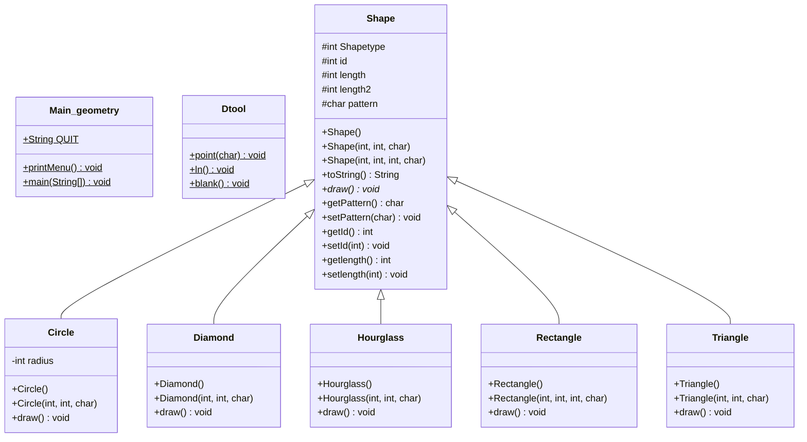

# HW6 코드 보고서 (HW9 반영 수정본)

---

## 과제 개요
기존 '과제4'의 ShapeDraw는 각 도형의 클래스가 공통으로 가지는 SuperClass가 없었기에, 도형의 종류수 만큼 배열을 선언해야하는 문제점이 있었습니다. 따라서 본 과제는 Inheritance기능을 사용하여 기존의 코드를 재구축하였습니다. 따라서 본 코드는 상속을 통한 '다형성(Polymorphism)'을 확보함으로써, 하나의 Shape 배열만으로 모든 하위 도형 객체를 관리할 수 있게 되어 코드의 유지보수성과 결합도가 개선되었습니다.

---
## 클래스 상속 관계 및 다이어그램
본 코드에선 Shape라는 SuperClass와 5개의 SubClass가 상속관계를 이루고 있습니다. 아래의 클래스 다이어그램을 참고 부탁드립니다.

---
## 유틸리티 클래스 (Dtool) 분석
유틸리티 클래스 'Dtool'에는 오직 static method만 존재합니다. 이는 5개의 도형 SubClass들이 공통적으로 draw()를 구현하는데 필요한 기능들을 담아두는 역할입니다.
ex) 점 찍기, 줄바꿈, 공백 출력

---
## matches 메서드를 활용한 코드 간결화
본 프로그램에서는 초기 입력값을 String형태로 받습니다. 그 이유는 특정 도형의 출력 로그를 보려면 '도형 타입' + 'log' 라는 키워드를 입력해야 하기 때문입니다. 초기 코드에선 이를 존재 가능한 모든 경우의 수를 if문에 작성해두고 입력값과 비교하는 형식으로 이루어졌습니다. 다만 이는 확장성이 매우 떨어지기에, 정규표현식(regex)과 matches 메서드를 이용하여 코드를 매우 간결화 했습니다. 또한 이를 위하여 각 SubClass들에게 고유의 int값을 부여하여 객체의 종류를 보다 쉽게 판별하게 하였습니다.

---
## 부모 클래스 기반 생성자 설계
Shape Class에는 3가지 생성자가 있습니다. 첫번째는 Default 생성자, 그리고 나머지 두개는 각각 파라미터 3개,4개를 요구하는 생성자입니다. 이는 SubClass에서 'super' 키워드를 통하여 상위 생성자를 찾을때, 가능한 모든 파라미터 종류를 미리 선언해둔 것입니다.

---
## 사용자 입력 예외 처리
기존 코드의 취약점이었던 예외처리 (음수값, 0 입력)에 대한 방어 코드를 보강했습니다.

---
## shapetype 변수와 instanceof 연산자 방식 고찰
본 코드는 instanceof 연산자를 사용하지 않았습니다. 그 이유는 먼저 instanceof를 사용할 시에는 모든 클래스에 대한 case를 만들어두어야 하지만, shapetype이란 int값으로 쉽게 객체의 종류를 판별 할 수 있으면 코드가 더욱 간결화되기 때문입니다. (위의 matches 관련 기술 참고) 다만, 이러한 방식에도 한계점이 있습니다. 'int shapetype'은 protected로 선언되어있는데, 이는 같은 패키지내에서 얼마든지 접근이 가능하기에 보안 측면에서는 매우 취약하다고 볼 수 있습니다. 각 두가지 방식에 대한 한계점을 잘 고민하여 더욱 뛰어난 방법을 고안해내는 것을 목표로 삼겠습니다.

---
## HW9 - 추가과제) I/O 입출력 기능 추가

프로그램 종료 후에도 관리 중인 도형 데이터를 영속적으로 유지하고 재사용할 수 있도록, `java.nio.file` 패키지의 API를 활용한 파일 입출력(I/O) 기능을 추가 구현했습니다.

### 1. 주요 기능 개요
* **메뉴 8 (Save):** 현재 배열(`Shape[] sArr`)에 저장되어 있는 모든 도형 객체의 식별 및 속성 정보를 `result.txt` 파일에 기록합니다.
* **메뉴 9 (Load):** `result.txt` 파일에 저장된 텍스트 데이터를 파싱하여 도형 객체 배열로 복원합니다.

### 2. 구현 방식 및 사용 문법

#### A. 파일 저장 (Save)
* **사용 문법:** `Files.writeString(Path.of("result.txt"), content);`
* **데이터 포맷:** `[도형타입] [ID] [길이1] [길이2] [패턴]\n`
* **설명:** * 전체 배열을 순회하며 유효한 도형 객체의 속성들을 공백(` `)을 구분자로 삼아 하나의 문자열로 결합합니다.

#### B. 파일 불러오기 (Load)
* **사용 문법:** `Scanner fileInput = new Scanner(Path.of("result.txt"));`
* **설명:**
  * 지정된 파일 경로로부터 데이터를 읽어오며, `fileInput.hasNextInt()` 메서드를 통해 읽어올 데이터가 존재하는지 검증하며 루프를 수행합니다.
  * 파일 내부 데이터를 `nextInt()` 및 `next().charAt(0)`을 이용하여 순차적으로 파싱합니다.
  * 파싱된 고유 `Shapetype` 분기에 따라 `switch-case` 문을 수행하여 해당하는 하위 클래스(`Rectangle`, `Triangle`, `Diamond`, `Hourglass`, `Circle`)의 생성자로 전달하고, 객체를 dynamic하게 재성성하여 인덱스 배열을 복구합니다.

### 3. 프로그램 안정성 (예외 처리)
* 파일 입출력 시 발생할 수 있는 지정 경로 부재, 읽기/쓰기 권한 오류 등 예기치 못한 `Exception`으로 인해 프로그램이 비정상 종료(Crash)되는 현상을 방지하기 위해 전 로직을 `try-catch` 블록으로 안전하게 감싸 예외 제어를 구현했습니다.

---

*본 문서는 자바 프로그래밍 과제 제출 및 GitHub 포트폴리오를 목적으로 작성되었습니다.*
---